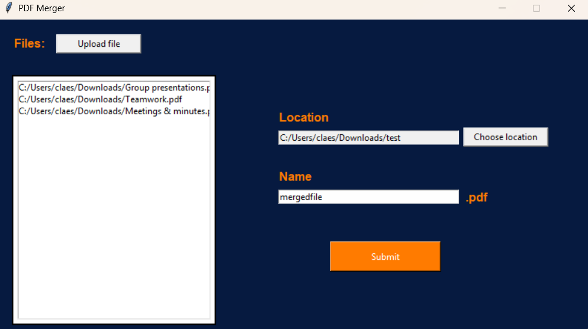

# PDF Merger

## 📌 Overview

This is a small desktop app I built using Python and Tkinter that lets you select multiple PDF files, pick a save location, name the final file, and merge them into one.

I made this project to practice working with file dialogs, GUI design, and libraries like `pypdf`. It’s not meant to be a polished commercial app, but it’s still fully usable if you ever need to merge PDFs quickly without uploading them online.

## 🖼️ Demo

## ⚙️ Installation

### 🪟 Windows

1. Download the latest `.exe` release from the [Releases](https://github.com/MikaClaes/pdf-merger/releases) page.
2. Double-click the `.exe` file to run the app — no installation needed.
3. If you see a Windows Defender warning, click **More info** → **Run anyway**.
4. The app will open with a simple GUI to select, name, and merge your PDF files.

    
## ✨ Features

- 📁 Upload multiple PDF files at once
- 💾 Choose custom save location
- ✏️ Name your merged PDF
- ✅ Simple interface
- 🧠 Error popups for missing inputs or file issues
- 🔒 Keeps your data local – no uploading to external servers

## 🧱 Tech Stack

- 🐍 Python
- 🧩 PyPDF
- 🖼️ Tkinter

## Lessons Learned

This project helped me practice working with **Tkinter** for GUI development and handling **file dialogs**, **listboxes**, and **user inputs**. I also learned how to use **PyPDF** to merge PDFs and how to build a working `.exe` using **PyInstaller**. On top of that, I got experience structuring a small but complete Python project, splitting logic from UI, and writing a clear README.

## 🏷 Badges

